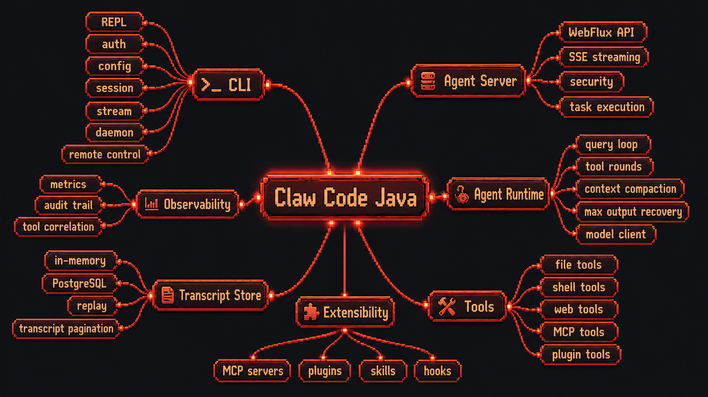
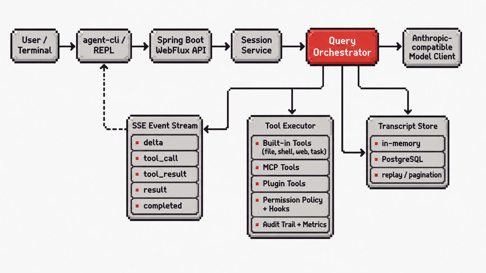

# Claw Code Java

[](https://github.com/lelik1813/claw-code-java/actions/workflows/ci.yml)
[](LICENSE)

<p align="center">
  
</p>

Claw Code Java is an experimental Java 21 / Spring Boot implementation of a Claude Code-like coding-agent runtime.

It is built for developers who want to inspect, extend, and experiment with the architecture behind terminal coding agents in a Java/Spring ecosystem. The project includes a WebFlux agent server, CLI/REPL client, tool execution, MCP transports, skills/plugins, hooks, SSE streaming, session replay, and optional PostgreSQL transcript persistence.

Status: early working implementation. The project runs locally and is under active development, so APIs, CLI behavior, and runtime contracts may change.

Claude Code is currently more mature and performs better in real-world coding-agent workflows. This project does not claim parity today. The goal is to provide an inspectable Java/Spring-based agent stack for learning, experimentation, MCP tooling, replay, persistence, and future parity work.

This project is not affiliated with Anthropic or Claude Code.

## Runtime Capability Map



Claw Code Java is organized as a thin CLI client backed by a Spring Boot WebFlux agent server. The server owns the agent loop, model calls, tool execution, permission checks, transcript storage, replay, SSE streaming, and observability.

## Agent Turn Lifecycle



The Query Orchestrator owns the turn loop: it builds provider requests, handles model tool calls, executes tools through the policy-checked Tool Executor, persists transcript messages, and streams public events back to the CLI over SSE.

## Current Repository Shape

- `src/main/java` - Spring Boot server, CLI, orchestration, tools, MCP, persistence, and security code.
- `src/main/resources` - application configuration and database migrations.
- `src/test/java` - unit and integration tests.
- `scripts` - standalone smoke-test scripts for CI and local verification.
- `.env.example` and `.env.production.example` - safe configuration templates.

## Requirements

- Java 21
- Maven wrapper from this repository
- Docker for the Testcontainers integration suite
- An Anthropic-compatible API key for real model calls

The application can start without a model key. In that mode it uses a no-op model client, which is useful for smoke tests and local wiring checks.

## Quick Start

Clone and test:

```bash
git clone https://github.com/lelik1813/claw-code-java.git
cd claw-code-java
./mvnw test -B
```

Windows PowerShell:

```powershell
git clone https://github.com/lelik1813/claw-code-java.git
cd claw-code-java
.\mvnw.cmd test -B
```

Build the standalone JAR:

```bash
./mvnw package -DskipUnitTests=true -B
```

For normal local use, start the server and REPL through the `launch` command below. It handles first-run configuration, local API-key settings, and in-memory persistence flags for the background daemon.

## One-Command Local Launch

Build once, then start the local server and open the REPL from one command:

```bash
./mvnw package -DskipUnitTests=true -B
./mvnw exec:java \
  -Dexec.mainClass=com.clawcode.agent.cli.AgentCliApplication \
  -Dexec.args="launch"
```

PowerShell:

```powershell
.\mvnw.cmd package -DskipUnitTests=true -B
.\mvnw.cmd exec:java `
  "-Dexec.mainClass=com.clawcode.agent.cli.AgentCliApplication" `
  "-Dexec.args=launch"
```

On first launch, the CLI writes local runtime settings under `~/.agent-cli`, starts the background daemon with API-key auth enabled, stores the matching CLI credentials, and opens the REPL. You can pass setup values non-interactively:

```bash
./mvnw exec:java \
  -Dexec.mainClass=com.clawcode.agent.cli.AgentCliApplication \
  -Dexec.args="launch --port 8080 --persistence in-memory --model-token <token>"
```

Use `--persistence postgres` when `POSTGRES_HOST`, `POSTGRES_PORT`, `POSTGRES_DB`, `POSTGRES_USER`, and `POSTGRES_PASSWORD` are already available in the launch environment.

## Configuration

Copy one of the safe templates and fill only the values you need:

```bash
cp .env.example .env
```

Common settings:

```env
SERVER_PORT=8080
PERSISTENCE_BACKEND=in-memory
ANTHROPIC_AUTH_TOKEN=
ANTHROPIC_DEFAULT_SONNET_MODEL=deepseek-v4-flash
APP_SECURITY_API_KEY_ENABLED=false
APP_SECURITY_API_KEY_KEY=
APP_TOOLS_ENABLED=false
APP_MCP_ENABLED=false
```

For PostgreSQL persistence, set `PERSISTENCE_BACKEND=postgres` and provide the database values from `.env.production.example`.

## Run With API-Key Auth

For local first-run development, prefer `launch`. Direct JAR server mode is useful when you want to run only the HTTP API and provide server settings yourself:

```bash
java -jar target/claw-code-java-*.jar \
  --app.security.api-key.enabled=true \
  --app.security.api-key.key=change-me
```

Create a session:

```bash
curl -X POST \
  -H "X-API-Key: change-me" \
  http://localhost:8080/api/sessions
```

Send a message:

```bash
curl -X POST \
  -H "X-API-Key: change-me" \
  -H "Content-Type: application/json" \
  -d '{"content":"say hello"}' \
  http://localhost:8080/api/sessions/<session-id>/messages
```

Attach to the SSE stream:

```bash
curl -N \
  -H "X-API-Key: change-me" \
  http://localhost:8080/api/sessions/<session-id>/stream
```

## CLI

After building the JAR, run the CLI main class through Maven:

```bash
./mvnw exec:java \
  -Dexec.mainClass=com.clawcode.agent.cli.AgentCliApplication \
  -Dexec.args="--help"
```

PowerShell:

```powershell
.\mvnw.cmd exec:java `
  "-Dexec.mainClass=com.clawcode.agent.cli.AgentCliApplication" `
  "-Dexec.args=--help"
```

The CLI can connect to a running server with `APP_CLI_BASE_URL`, `APP_CLI_API_KEY_HEADER`, and `APP_CLI_API_KEY`.


## Development

This repository is the active development workspace for Claw Code Java. For the public development workflow, local launch command, tests, and CI expectations, see [CONTRIBUTING.md](CONTRIBUTING.md).

## Verification

Unit tests:

```bash
./mvnw test -B
```

Integration tests with Testcontainers:

```bash
./mvnw verify -B -DskipUnitTests=true
```

Standalone smoke test:

```bash
./mvnw package -DskipUnitTests=true -B
APP_SECURITY_API_KEY_KEY=smoke-test-key java -jar target/claw-code-java-*.jar
BASE_URL=http://localhost:8080 API_KEY=smoke-test-key bash scripts/phase8-smoke.sh
```

CI runs unit tests, Testcontainers integration tests, and a standalone JAR smoke test on every push and pull request to `main`.

## Troubleshooting

- `./mvnw: Permission denied` - run `chmod +x mvnw` on Unix-like systems.
- Testcontainers fails locally - start Docker Desktop or a compatible Docker daemon.
- The server starts but model responses are `noop` - set `ANTHROPIC_AUTH_TOKEN` for real model calls.
- API requests return `401` - pass the configured `X-API-Key` header or disable API-key auth for local testing.

## License

MIT License. See [LICENSE](LICENSE).
